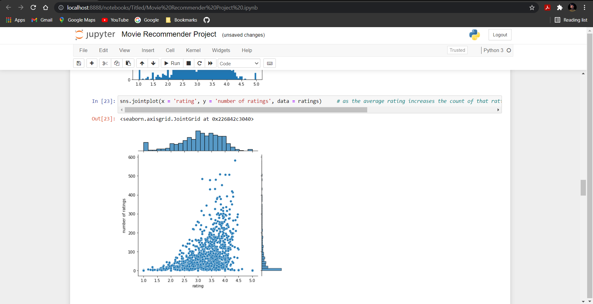
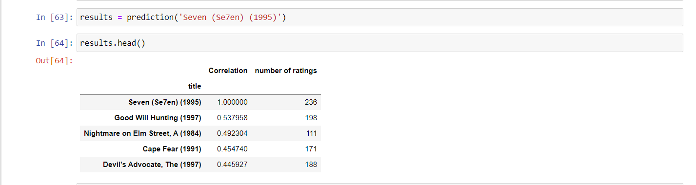

# Movie-Recommendation-System
Built a movie recommendation system which suggests movies related to user's prescribed movie.

## Working of Code:
1. To load the movie dataset, clean and preprocess it.
1. To analyse and visualize the movie dataset which consist of 100000 instances and 4 features.
   1. Made a histogram to visualize the distribution of ratings with the total number of ratings provided.
   2. Made a jointplot using seaborn library to visualize increment in the count of ratings.
1. Built a correlation matrix to find relation between all the unique movies in the dataset.
1. List all the movies which are highly correlated to user's prescribed movie using the correlation matrix.

## File-wise explanation:
* Movie Recommender Project.ipynb: to clean, preprocess, analyse the dataset and finally list the related movies.
* u.data: contains movie-id and rating.
* u.item: contains movie-id and movie-title.

## Code Snippets:

